# Design Document

## Overview

OpenSpec is a Next.js 14 web application that replicates Kiro IDE's Spec Mode functionality using OpenRouter's API for AI model access. The system follows a three-phase workflow (Requirements → Design → Tasks) with iterative refinement capabilities, automatic Mermaid diagram generation, and browser-based storage. The architecture prioritizes simplicity, performance, and developer experience while maintaining compatibility with Vercel deployment.

## System Architecture

### High-Level Architecture
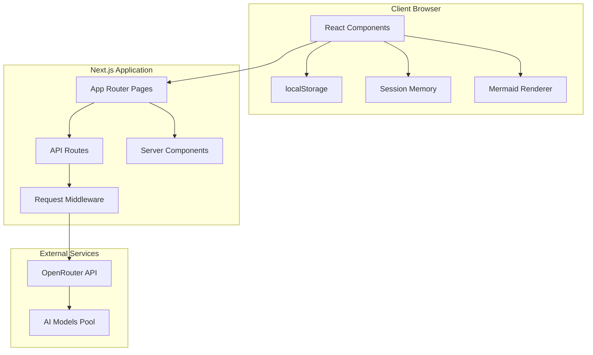

### User Flow Architecture
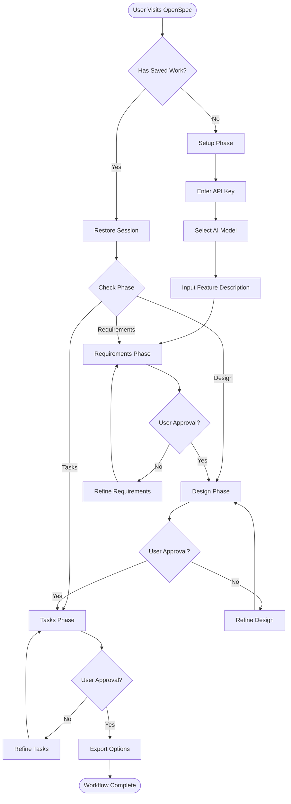

## Component Architecture

### Component Hierarchy
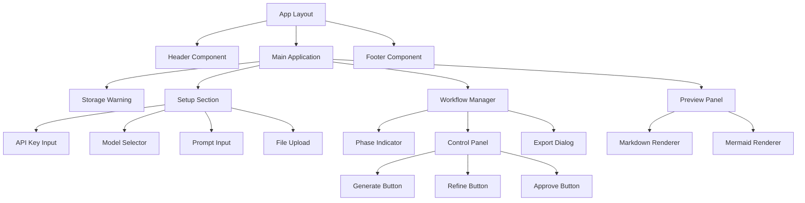

### State Management Flow
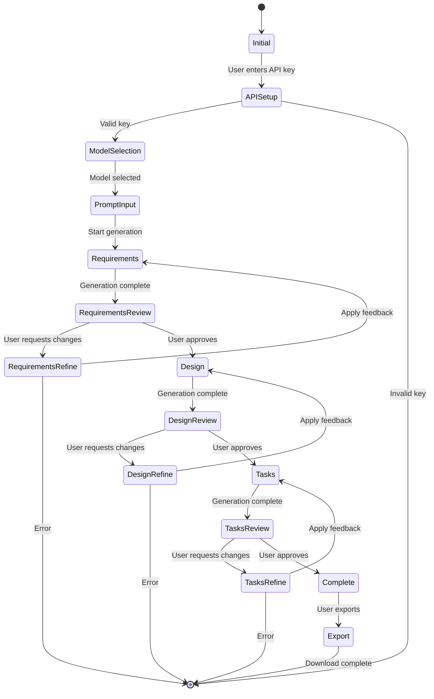

## Data Models

### Core Data Structures
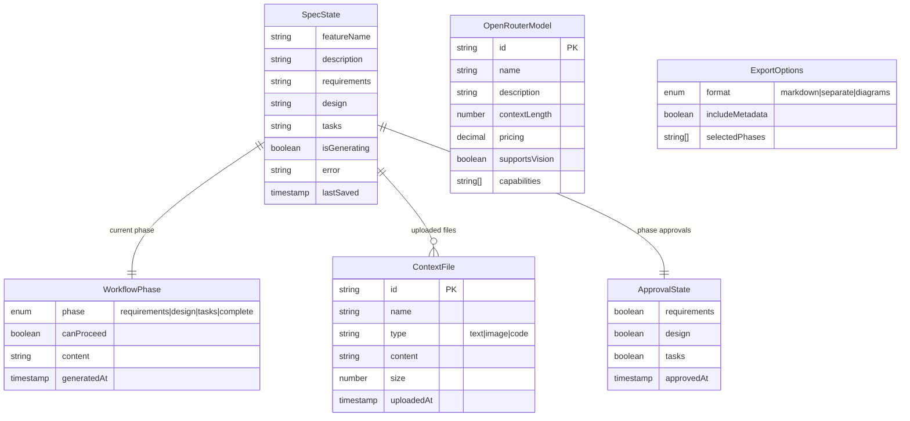

## API Design

### OpenRouter Integration
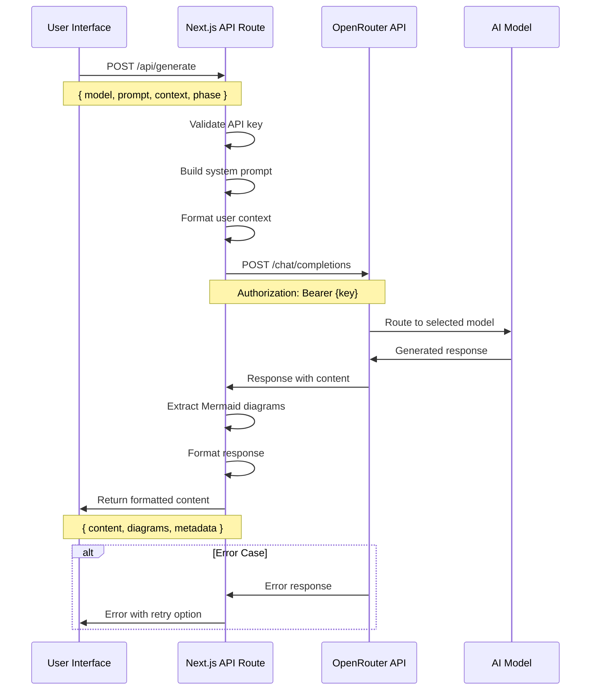

### API Endpoints

#### POST /api/generate
Generates content for the current workflow phase.

**Request:**
```typescript
interface GenerateRequest {
  model: string;
  phase: 'requirements' | 'design' | 'tasks';
  prompt: string;
  context?: Array<{
    type: 'text' | 'image';
    content: string;
    filename?: string;
  }>;
  refinement?: {
    currentContent: string;
    feedback: string;
  };
}
```

**Response:**
```typescript
interface GenerateResponse {
  content: string;
  diagrams: Array<{
    type: string;
    code: string;
    title?: string;
  }>;
  metadata: {
    model: string;
    tokensUsed: number;
    generatedAt: string;
  };
}
```

#### GET /api/models
Fetches available OpenRouter models.

**Response:**
```typescript
interface ModelsResponse {
  models: Array<{
    id: string;
    name: string;
    description: string;
    contextLength: number;
    pricing: {
      prompt: number;
      completion: number;
    };
    capabilities: string[];
  }>;
}
```

## Security Design

### API Key Management
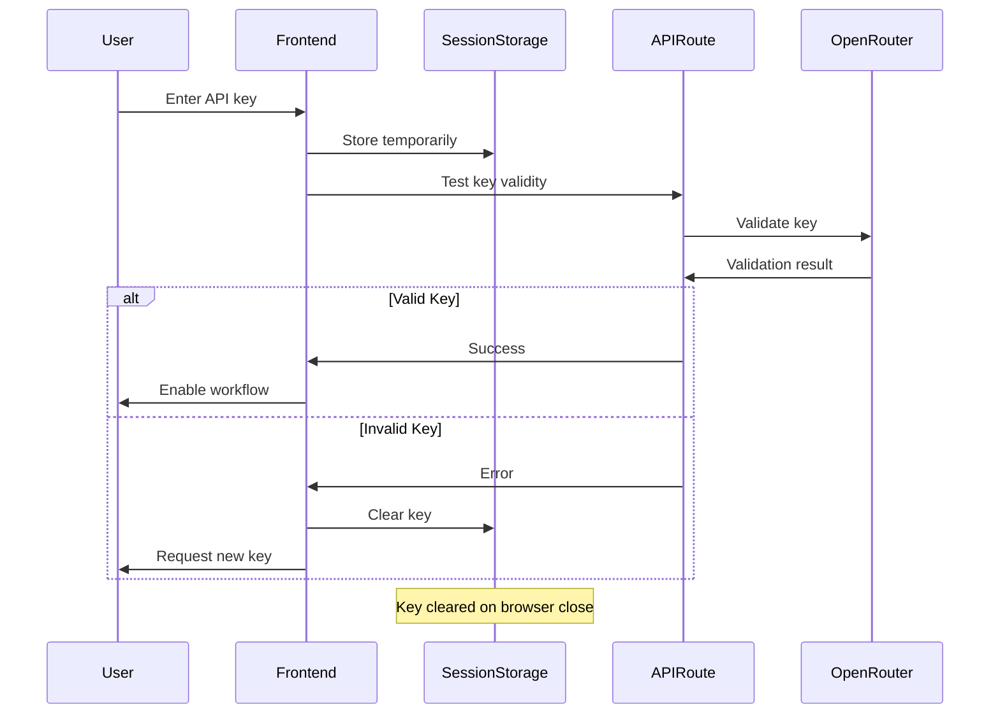

### Data Protection Strategy
- **API Keys**: Stored only in sessionStorage, cleared on browser close
- **Generated Content**: Stored in localStorage with clear warnings about persistence
- **File Uploads**: Processed client-side, never sent to server permanently
- **CORS**: Configured for Vercel deployment domain only
- **Rate Limiting**: Implemented at API route level to prevent abuse

## Error Handling Strategy

### Error Categories and Recovery
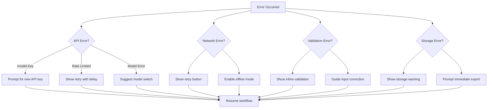

### Error Recovery Mechanisms
1. **Automatic Retry**: Network errors with exponential backoff
2. **Graceful Degradation**: Continue with cached content when API fails
3. **User Guidance**: Clear error messages with actionable steps
4. **State Preservation**: Maintain user work during error recovery
5. **Fallback Options**: Alternative models when primary fails

## Performance Considerations

### Optimization Strategy
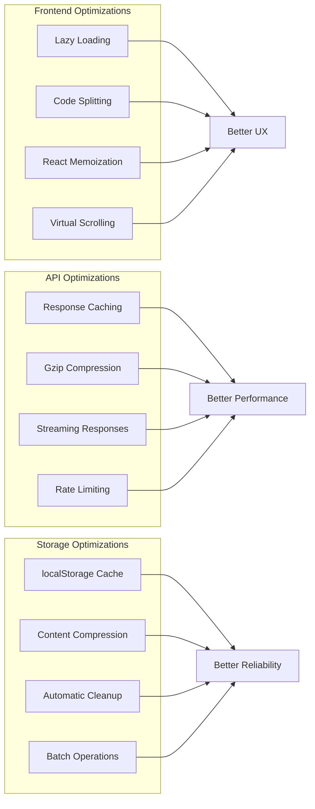

### Caching Strategy
- **Model List**: Cache for 1 hour to reduce API calls
- **Generated Content**: Auto-save to localStorage every 30 seconds
- **Mermaid Diagrams**: Cache rendered SVGs to avoid re-rendering
- **API Responses**: Cache successful responses for session duration

## Testing Strategy

### Test Architecture
```mermaid
graph TD
    subgraph "Unit Tests"
        ComponentTests[Component Tests]
        HookTests[Hook Tests]
        UtilTests[Utility Tests]
        APITests[API Route Tests]
    end
    
    subgraph "Integration Tests"
        WorkflowTests[Workflow Integration]
        APIIntegration[OpenRouter Integration]
        StorageTests[Storage Integration]
    end
    
    subgraph "E2E Tests"
        UserJourney[Complete User Journey]
        ErrorScenarios[Error Scenarios]
        ExportFlow[Export Functionality]
    end
    
    ComponentTests --> TestRunner[Jest + Testing Library]
    HookTests --> TestRunner
    UtilTests --> TestRunner
    APITests --> TestRunner
    
    WorkflowTests --> Playwright[Playwright E2E]
    APIIntegration --> Playwright
    StorageTests --> Playwright
    
    UserJourney --> Cypress[Cypress Tests]
    ErrorScenarios --> Cypress
    ExportFlow --> Cypress
```

### Test Coverage Goals
- **Unit Tests**: 90% coverage for utilities and hooks
- **Component Tests**: 85% coverage for UI components
- **Integration Tests**: Cover all API integrations and workflows
- **E2E Tests**: Cover complete user journeys and error scenarios

## Deployment Architecture

### Vercel Deployment Strategy
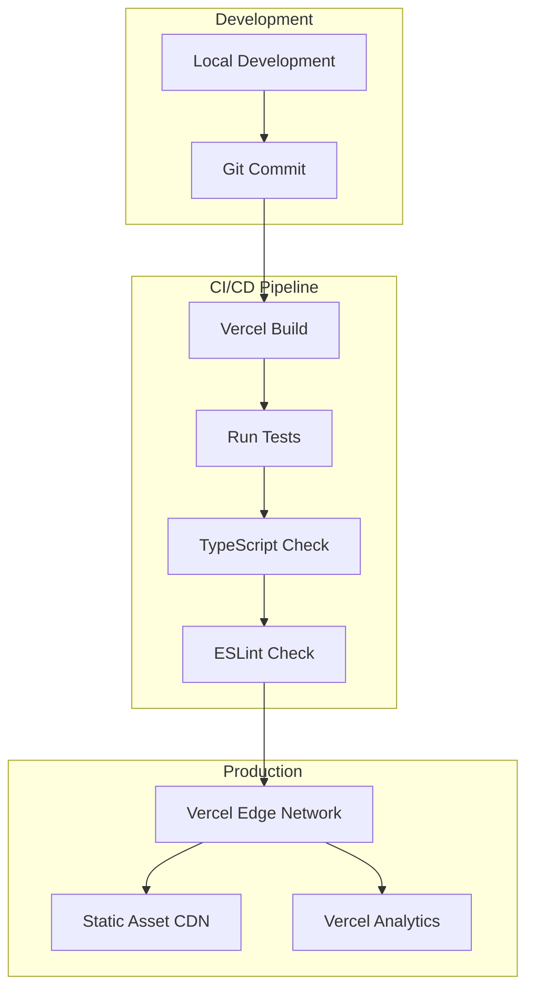

### Environment Configuration
- **Development**: Local development with hot reload
- **Preview**: Automatic preview deployments for PRs
- **Production**: Optimized build with edge caching
- **Environment Variables**: API keys and configuration via Vercel dashboard

## Technology Decisions

### Frontend Stack Rationale
- **Next.js 14**: App Router for modern React patterns, built-in optimization
- **Tailwind CSS**: Rapid UI development with consistent design system
- **shadcn/ui**: High-quality, accessible components with customization
- **react-markdown**: Reliable markdown rendering with plugin support
- **Mermaid**: Industry standard for diagram generation

### State Management Approach
- **React Hooks**: Built-in state management for component-level state
- **Custom Hooks**: Encapsulate complex logic (useSpecWorkflow, useLocalStorage)
- **Context API**: Share global state (API key, current model) when needed
- **localStorage**: Persist user work across sessions

### API Integration Strategy
- **OpenRouter**: Single API for multiple AI models, transparent pricing
- **Server-Side Proxy**: Hide API keys, add rate limiting, enable CORS
- **Error Handling**: Comprehensive error recovery and user feedback
- **Streaming**: Future enhancement for real-time generation feedback

## Accessibility Considerations

### WCAG 2.1 Compliance
- **Keyboard Navigation**: Full keyboard accessibility for all interactions
- **Screen Reader Support**: Proper ARIA labels and semantic HTML
- **Color Contrast**: Minimum 4.5:1 contrast ratio for all text
- **Focus Management**: Clear focus indicators and logical tab order
- **Alternative Text**: Descriptive alt text for generated diagrams

### Inclusive Design Features
- **Responsive Design**: Works on all device sizes and orientations
- **Reduced Motion**: Respect user preferences for animation
- **High Contrast Mode**: Support for high contrast themes
- **Font Scaling**: Support for user font size preferences

## Monitoring and Analytics

### Performance Monitoring
- **Vercel Analytics**: Built-in performance and usage analytics
- **Core Web Vitals**: Monitor LCP, FID, CLS metrics
- **Error Tracking**: Client-side error reporting and analysis
- **API Monitoring**: Track OpenRouter API response times and errors

### User Analytics
- **Usage Patterns**: Track workflow completion rates
- **Feature Adoption**: Monitor which features are most used
- **Error Rates**: Identify common user error scenarios
- **Export Metrics**: Track export format preferences