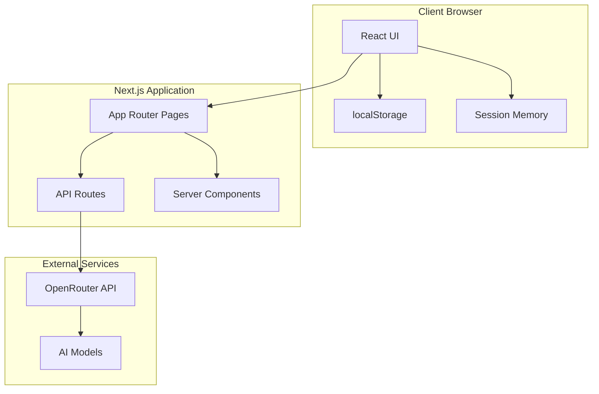

# Product Requirements Document (PRD): OpenSpec

## Executive Summary

**Product Name:** OpenSpec  
**Version:** 1.0 MVP  
**Category:** Productivity & Workflow Tools (Kiro Hackathon)  
**License:** MIT License  
**Tagline:** "Open-source Kiro Spec Mode powered by OpenRouter"

OpenSpec is a lightweight web application that replicates Kiro IDE's Spec Mode functionality, enabling developers to generate structured specifications (requirements.md, design.md, tasks.md) with automatic Mermaid diagram generation using any AI model available through OpenRouter.

## Problem Statement

Kiro's Spec Mode is a powerful feature locked within their IDE. OpenSpec democratizes this capability by:
- Providing the same spec-driven development workflow through a web interface
- Supporting any AI model via OpenRouter (not just Kiro's default)
- Offering a completely open-source alternative
- Enabling developers to use spec mode without IDE installation
- Automatically generating visual diagrams for better specification clarity

## Target Audience

### Primary Users
- Individual developers using vibe coding/agentic coding approaches
- Small development teams needing spec documentation
- Open-source contributors requiring standardized specifications

### Secondary Users
- Technical writers creating project documentation
- Product managers defining technical requirements
- Hackathon participants needing rapid prototyping

## Core Functionality

### The Spec Workflow (Kiro Spec Mode Replication)

OpenSpec follows the exact three-phase workflow from Kiro:

1. **Requirements Phase** → generates requirements.md
2. **Design Phase** → generates design.md with diagrams
3. **Tasks Phase** → generates tasks.md

Each phase includes:
- Initial generation based on user input
- Iterative refinement through feedback
- Explicit approval before proceeding

### Key Features

#### 1. One-Shot API Key Entry
- No authentication system
- User enters OpenRouter API key per session
- Key stored only in memory during use
- Warning about browser storage limitations

#### 2. Multi-Model Support
- Access to all OpenRouter models
- Automatic filtering for vision models when files uploaded
- Real-time pricing and context length display
- Model search and selection interface

#### 3. Context Input Methods
- Text prompt box for feature descriptions
- File upload support (code, docs, images)
- Drag-and-drop interface
- Support for multiple file types

#### 4. Automatic Diagram Generation
- User flow diagrams for multiple user types
- System architecture diagrams
- Sequence diagrams for interactions
- Entity relationship diagrams for data models
- All diagrams in Mermaid format

#### 5. Browser-Based Storage
- All data stored in localStorage
- Clear warnings about data persistence
- Auto-save during workflow
- Session recovery on page reload

#### 6. Export Capabilities
- Export to markdown format
- Individual file downloads (requirements.md, design.md, tasks.md)
- Combined export with all specifications
- Diagram export as SVG files

## Technical Architecture

### Technology Stack

```yaml
Frontend Framework: Next.js 14 (App Router)
UI Components: Tailwind CSS + shadcn/ui
Markdown Rendering: react-markdown
Diagram Rendering: mermaid
Code Editor: Monaco Editor
API Integration: OpenRouter API
Storage: Browser localStorage
Deployment: Vercel
```

### System Architecture



### File Structure

```
openspec/
├── app/
│   ├── page.tsx                 # Main application page
│   ├── api/
│   │   └── generate/
│   │       └── route.ts         # OpenRouter API handler
│   ├── layout.tsx               # Root layout with metadata
│   └── globals.css              # Global styles
│
├── components/
│   ├── ui/                      # shadcn/ui components
│   ├── api-key-input.tsx        # API key entry component
│   ├── model-selector.tsx       # Model selection with search
│   ├── spec-generator.tsx       # Main workflow orchestrator
│   ├── prompt-input.tsx         # Text and file input
│   ├── context-uploader.tsx     # File upload handler
│   ├── spec-preview.tsx         # Markdown + Mermaid preview
│   ├── mermaid-renderer.tsx     # Diagram rendering
│   ├── phase-indicator.tsx      # Workflow progress display
│   ├── export-dialog.tsx        # Export options modal
│   └── storage-warning.tsx      # Browser storage warning
│
├── lib/
│   ├── openrouter/
│   │   ├── client.ts           # OpenRouter API client
│   │   ├── models.ts           # Model configurations
│   │   └── types.ts            # TypeScript interfaces
│   ├── prompts/
│   │   ├── requirements.ts     # Requirements generation prompt
│   │   ├── design.ts           # Design + diagrams prompt
│   │   ├── tasks.ts            # Task generation prompt
│   │   └── refinement.ts       # Iterative refinement prompts
│   ├── diagram-generator.ts     # Mermaid diagram utilities
│   ├── storage.ts              # localStorage management
│   ├── export.ts               # Export functionality
│   └── utils.ts                # Helper functions
│
├── hooks/
│   ├── useSpecWorkflow.ts      # Main workflow state management
│   ├── useLocalStorage.ts      # localStorage hook
│   └── useDiagramRenderer.ts   # Mermaid rendering hook
│
├── types/
│   └── index.ts                # TypeScript type definitions
│
├── public/
│   ├── favicon.ico
│   └── og-image.png            # Open Graph image
│
├── .kiro/                       # Kiro's own specs
│   ├── specs/
│   │   └── openspec/
│   │       ├── requirements.md
│   │       ├── design.md
│   │       └── tasks.md
│   └── steering/
│       └── openspec-rules.md
│
├── README.md                    # Project documentation
├── LICENSE                      # MIT License
├── package.json
├── tsconfig.json
├── next.config.js
└── vercel.json                  # Deployment configuration
```

## User Interface Design

### Main Application Interface

```
┌────────────────────────────────────────────────────────────────┐
│ OpenSpec - Open Source Kiro Spec Mode              [GitHub] 🔗 │
├────────────────────────────────────────────────────────────────┤
│ ⚠️ Data stored in browser only. Export specs before closing!   │
├────────────────────────────────────────────────────────────────┤
│                                                                │
│ Step 1: Configure                                             │
│ ┌──────────────────────────────────────────────────────────┐ │
│ │ OpenRouter API Key: [_____________________] [?] Guide     │ │
│ │                                                            │ │
│ │ Select Model: [▼ Claude 3.5 Sonnet        ] 🔍           │ │
│ │              $3.00/1M tokens | 200k context | 📷 Vision   │ │
│ └──────────────────────────────────────────────────────────┘ │
│                                                                │
│ Step 2: Describe Your Feature                                 │
│ ┌──────────────────────────────────────────────────────────┐ │
│ │ Feature Name: [ecommerce-platform]                        │ │
│ │                                                            │ │
│ │ Description:                                               │ │
│ │ ┌────────────────────────────────────────────────────┐   │ │
│ │ │ Build an e-commerce platform with separate admin    │   │ │
│ │ │ and customer portals. Admin users can manage       │   │ │
│ │ │ products, orders, and analytics. Customers can      │   │ │
│ │ │ browse products, add to cart, and checkout.         │   │ │
│ │ └────────────────────────────────────────────────────┘   │ │
│ │                                                            │ │
│ │ 📎 Add Context Files (optional)                           │ │
│ │ ┌────────────────────────────────────────────────────┐   │ │
│ │ │ Drop files here or click to browse                  │   │ │
│ │ │ Supports: .md, .txt, .js, .ts, .json, images       │   │ │
│ │ └────────────────────────────────────────────────────┘   │ │
│ └──────────────────────────────────────────────────────────┘ │
│                                                                │
│ Workflow Progress                                             │
│ ┌──────────────────────────────────────────────────────────┐ │
│ │  Requirements ──→ Design ──→ Tasks ──→ Export            │ │
│ │       ●            ○          ○         ○                │ │
│ └──────────────────────────────────────────────────────────┘ │
│                                                                │
│ ┌─────────────────────┬──────────────────────────────────┐   │
│ │ Controls            │ Preview                          │   │
│ ├─────────────────────┼──────────────────────────────────┤   │
│ │                     │ # Requirements Document          │   │
│ │ [Start Generation]  │                                  │   │
│ │                     │ ## Introduction                  │   │
│ │ Current Phase:      │ An e-commerce platform that...  │   │
│ │ Requirements        │                                  │   │
│ │                     │ ## User Flows                   │   │
│ │ Actions:            │ ┌─────────────────────┐         │   │
│ │ [Request Changes]   │ │   [Mermaid Diagram  │         │   │
│ │ [Approve →]         │ │    Rendering Here]  │         │   │
│ │                     │ └─────────────────────┘         │   │
│ │ Export Options:     │                                  │   │
│ │ [📥 Export All]     │ ## Requirements                  │   │
│ │ [📊 Export Diagrams]│                                  │   │
│ │ [📄 Export Markdown]│ ### Requirement 1                │   │
│ │                     │ **User Story:** As an admin...  │   │
│ └─────────────────────┴──────────────────────────────────┘   │
│                                                                │
│ Status: Generating requirements... [████████░░] 80%           │
└────────────────────────────────────────────────────────────────┘
```

## Implementation Details

### 1. OpenRouter Integration

```typescript
// lib/openrouter/client.ts
import { OpenRouterModel, GenerateOptions } from './types';

export class OpenRouterClient {
  private apiKey: string;
  private baseUrl = 'https://openrouter.ai/api/v1';
  
  constructor(apiKey: string) {
    this.apiKey = apiKey;
  }
  
  async generateCompletion(
    model: string,
    systemPrompt: string,
    userPrompt: string,
    context?: Array<{ type: 'text' | 'image'; content: string }>
  ): Promise<string> {
    const messages = this.buildMessages(systemPrompt, userPrompt, context);
    
    const response = await fetch(`${this.baseUrl}/chat/completions`, {
      method: 'POST',
      headers: {
        'Authorization': `Bearer ${this.apiKey}`,
        'HTTP-Referer': window.location.origin,
        'X-Title': 'OpenSpec',
        'Content-Type': 'application/json'
      },
      body: JSON.stringify({
        model,
        messages,
        temperature: 0.3,
        max_tokens: 8192,
        stream: false
      })
    });
    
    if (!response.ok) {
      throw new Error(`OpenRouter API error: ${response.statusText}`);
    }
    
    const data = await response.json();
    return data.choices[0].message.content;
  }
  
  async getAvailableModels(): Promise<OpenRouterModel[]> {
    const response = await fetch(`${this.baseUrl}/models`);
    const data = await response.json();
    return data.data;
  }
  
  private buildMessages(
    systemPrompt: string,
    userPrompt: string,
    context?: Array<{ type: 'text' | 'image'; content: string }>
  ) {
    const messages = [
      { role: 'system', content: systemPrompt }
    ];
    
    if (context && context.length > 0) {
      const contextContent = context.map(item => {
        if (item.type === 'image') {
          return { type: 'image_url', image_url: { url: item.content } };
        }
        return { type: 'text', text: item.content };
      });
      
      messages.push({
        role: 'user',
        content: [
          { type: 'text', text: userPrompt },
          ...contextContent
        ]
      });
    } else {
      messages.push({ role: 'user', content: userPrompt });
    }
    
    return messages;
  }
}
```

### 2. Spec Workflow Hook

```typescript
// hooks/useSpecWorkflow.ts
import { useState, useEffect } from 'react';
import { OpenRouterClient } from '@/lib/openrouter/client';
import { 
  REQUIREMENTS_PROMPT, 
  DESIGN_PROMPT, 
  TASKS_PROMPT 
} from '@/lib/prompts';

export type WorkflowPhase = 'requirements' | 'design' | 'tasks' | 'complete';

interface SpecState {
  phase: WorkflowPhase;
  featureName: string;
  description: string;
  requirements: string;
  design: string;
  tasks: string;
  context: Array<{ type: 'text' | 'image'; content: string }>;
  isGenerating: boolean;
  error: string | null;
  approvals: {
    requirements: boolean;
    design: boolean;
    tasks: boolean;
  };
}

export function useSpecWorkflow(apiKey: string, model: string) {
  const [state, setState] = useState<SpecState>(() => {
    const saved = localStorage.getItem('openspec-state');
    return saved ? JSON.parse(saved) : {
      phase: 'requirements',
      featureName: '',
      description: '',
      requirements: '',
      design: '',
      tasks: '',
      context: [],
      isGenerating: false,
      error: null,
      approvals: {
        requirements: false,
        design: false,
        tasks: false
      }
    };
  });
  
  const client = apiKey ? new OpenRouterClient(apiKey) : null;
  
  // Auto-save to localStorage
  useEffect(() => {
    localStorage.setItem('openspec-state', JSON.stringify(state));
  }, [state]);
  
  const generateRequirements = async () => {
    if (!client) return;
    
    setState(prev => ({ ...prev, isGenerating: true, error: null }));
    
    try {
      const requirements = await client.generateCompletion(
        model,
        REQUIREMENTS_PROMPT,
        state.description,
        state.context
      );
      
      setState(prev => ({
        ...prev,
        requirements,
        isGenerating: false
      }));
    } catch (error) {
      setState(prev => ({
        ...prev,
        error: error.message,
        isGenerating: false
      }));
    }
  };
  
  const generateDesign = async () => {
    if (!client) return;
    
    setState(prev => ({ ...prev, isGenerating: true, error: null }));
    
    try {
      const prompt = `
        Based on these requirements:
        ${state.requirements}
        
        Create a comprehensive design document with architecture diagrams.
      `;
      
      const design = await client.generateCompletion(
        model,
        DESIGN_PROMPT,
        prompt,
        state.context
      );
      
      setState(prev => ({
        ...prev,
        design,
        isGenerating: false
      }));
    } catch (error) {
      setState(prev => ({
        ...prev,
        error: error.message,
        isGenerating: false
      }));
    }
  };
  
  const generateTasks = async () => {
    if (!client) return;
    
    setState(prev => ({ ...prev, isGenerating: true, error: null }));
    
    try {
      const prompt = `
        Based on these requirements and design:
        ${state.requirements}
        ${state.design}
        
        Create an implementation task list.
      `;
      
      const tasks = await client.generateCompletion(
        model,
        TASKS_PROMPT,
        prompt
      );
      
      setState(prev => ({
        ...prev,
        tasks,
        isGenerating: false
      }));
    } catch (error) {
      setState(prev => ({
        ...prev,
        error: error.message,
        isGenerating: false
      }));
    }
  };
  
  const refineCurrentPhase = async (feedback: string) => {
    if (!client) return;
    
    const currentContent = state[state.phase];
    const prompt = `
      Current ${state.phase} document:
      ${currentContent}
      
      User feedback: ${feedback}
      
      Please update the document based on this feedback.
    `;
    
    setState(prev => ({ ...prev, isGenerating: true, error: null }));
    
    try {
      const refined = await client.generateCompletion(
        model,
        getPromptForPhase(state.phase),
        prompt
      );
      
      setState(prev => ({
        ...prev,
        [state.phase]: refined,
        isGenerating: false
      }));
    } catch (error) {
      setState(prev => ({
        ...prev,
        error: error.message,
        isGenerating: false
      }));
    }
  };
  
  const approvePhase = () => {
    setState(prev => {
      const newApprovals = {
        ...prev.approvals,
        [prev.phase]: true
      };
      
      const nextPhase = getNextPhase(prev.phase);
      
      return {
        ...prev,
        approvals: newApprovals,
        phase: nextPhase
      };
    });
    
    // Auto-generate next phase
    const nextPhase = getNextPhase(state.phase);
    if (nextPhase === 'design') generateDesign();
    if (nextPhase === 'tasks') generateTasks();
  };
  
  const reset = () => {
    localStorage.removeItem('openspec-state');
    setState({
      phase: 'requirements',
      featureName: '',
      description: '',
      requirements: '',
      design: '',
      tasks: '',
      context: [],
      isGenerating: false,
      error: null,
      approvals: {
        requirements: false,
        design: false,
        tasks: false
      }
    });
  };
  
  return {
    state,
    actions: {
      setFeatureName: (name: string) => 
        setState(prev => ({ ...prev, featureName: name })),
      setDescription: (desc: string) => 
        setState(prev => ({ ...prev, description: desc })),
      addContext: (context: Array<{ type: 'text' | 'image'; content: string }>) =>
        setState(prev => ({ ...prev, context: [...prev.context, ...context] })),
      generateRequirements,
      generateDesign,
      generateTasks,
      refineCurrentPhase,
      approvePhase,
      reset
    }
  };
}

function getNextPhase(current: WorkflowPhase): WorkflowPhase {
  const phases: WorkflowPhase[] = ['requirements', 'design', 'tasks', 'complete'];
  const currentIndex = phases.indexOf(current);
  return phases[Math.min(currentIndex + 1, phases.length - 1)];
}

function getPromptForPhase(phase: WorkflowPhase): string {
  switch (phase) {
    case 'requirements': return REQUIREMENTS_PROMPT;
    case 'design': return DESIGN_PROMPT;
    case 'tasks': return TASKS_PROMPT;
    default: return '';
  }
}
```

### 3. System Prompts

```typescript
// lib/prompts/requirements.ts
export const REQUIREMENTS_PROMPT = `
You are helping transform a feature idea into a requirements document following the spec-driven development methodology.

Generate requirements in EARS format (Easy Approach to Requirements Syntax) with this structure:

# Requirements Document

## Introduction
[Clear summary of the feature - 2-3 paragraphs explaining the purpose and scope]

## User Types
[If multiple user types are identified, list them here]
- User Type 1: Description
- User Type 2: Description

## User Flows

### Overall User Flow
\`\`\`mermaid
graph TD
    Start([User Entry])
    Start --> CheckUser{Identify User Type}
    
    CheckUser -->|Type 1| Flow1[User Type 1 Flow]
    CheckUser -->|Type 2| Flow2[User Type 2 Flow]
    
    subgraph Flow1[User Type 1 Journey]
        A1[Action 1] --> A2[Action 2]
        A2 --> A3[Decision]
        A3 -->|Yes| A4[Result A]
        A3 -->|No| A5[Result B]
    end
    
    subgraph Flow2[User Type 2 Journey]
        B1[Action 1] --> B2[Action 2]
        B2 --> B3[Result]
    end
\`\`\`

## Requirements

### Requirement 1: [Feature Name]
**User Story:** As a [role], I want [feature], so that [benefit]

#### Acceptance Criteria
1. WHEN [event/trigger] THEN [system] SHALL [response/action]
2. IF [precondition] THEN [system] SHALL [behavior]
3. WHILE [condition] THE [system] SHALL [maintain state]
4. WHERE [condition applies] THE [system] SHALL [apply rule]

### Requirement 2: [Feature Name]
[Continue with all requirements...]

## Non-Functional Requirements

### Performance
- Response time requirements
- Throughput requirements
- Resource usage limits

### Security
- Authentication requirements
- Authorization requirements
- Data protection requirements

### Usability
- Accessibility requirements
- User experience requirements
- Error handling requirements

## Success Criteria
- Measurable outcomes that indicate successful implementation
- Acceptance test scenarios
- Performance benchmarks

## Constraints and Assumptions
- Technical constraints
- Business constraints
- Assumptions made

Focus on:
- Identifying ALL user types (admin, end user, developer, etc.)
- Creating clear user stories for each requirement
- Using EARS format consistently
- Considering edge cases and error scenarios
- Making requirements testable and measurable
`;

// lib/prompts/design.ts
export const DESIGN_PROMPT = `
Based on the approved requirements, create a comprehensive design document with visual diagrams.

# Design Document

## Overview
[High-level summary of the system design and architecture decisions]

## System Architecture

### Architecture Diagram
\`\`\`mermaid
graph TB
    subgraph "Presentation Layer"
        UI[User Interface]
        Mobile[Mobile App]
        API[API Gateway]
    end
    
    subgraph "Business Logic Layer"
        Auth[Authentication Service]
        Core[Core Business Logic]
        Process[Process Engine]
    end
    
    subgraph "Data Layer"
        DB[(Primary Database)]
        Cache[(Cache Layer)]
        Queue[Message Queue]
    end
    
    UI --> API
    Mobile --> API
    API --> Auth
    API --> Core
    Core --> Process
    Core --> DB
    Core --> Cache
    Process --> Queue
\`\`\`

## Sequence Diagrams

### [Key Process Name]
\`\`\`mermaid
sequenceDiagram
    participant User
    participant Frontend
    participant API
    participant Service
    participant Database
    
    User->>Frontend: Initiate Action
    Frontend->>API: Send Request
    API->>Service: Process Request
    Service->>Database: Query Data
    Database-->>Service: Return Data
    Service-->>API: Process Response
    API-->>Frontend: Return Response
    Frontend-->>User: Display Result
\`\`\`

## Data Models

### Entity Relationship Diagram
\`\`\`mermaid
erDiagram
    USER ||--o{ ORDER : places
    USER {
        uuid id PK
        string email UK
        string name
        timestamp created_at
    }
    
    ORDER ||--|{ ORDER_ITEM : contains
    ORDER {
        uuid id PK
        uuid user_id FK
        decimal total
        string status
        timestamp created_at
    }
    
    ORDER_ITEM }|--|| PRODUCT : references
    ORDER_ITEM {
        uuid id PK
        uuid order_id FK
        uuid product_id FK
        int quantity
        decimal price
    }
    
    PRODUCT {
        uuid id PK
        string name
        decimal price
        int stock
    }
\`\`\`

## State Management

### State Diagram
\`\`\`mermaid
stateDiagram-v2
    [*] --> Initial
    Initial --> Loading : Start Process
    Loading --> Success : Data Loaded
    Loading --> Error : Load Failed
    Success --> Updating : User Action
    Updating --> Success : Update Complete
    Updating --> Error : Update Failed
    Error --> Loading : Retry
    Success --> [*] : Complete
    Error --> [*] : Exit
\`\`\`

## API Design

### REST Endpoints
[List all API endpoints with methods, paths, and descriptions]

### Request/Response Schemas
[Define JSON schemas for requests and responses]

## Component Design

### Frontend Components
[Component hierarchy and responsibilities]

### Backend Services
[Service architecture and interactions]

## Security Design

### Authentication Flow
[Describe authentication mechanism]

### Authorization Model
[Define roles and permissions]

### Data Protection
[Encryption and security measures]

## Error Handling Strategy

### Error Types
[Categorize potential errors]

### Recovery Mechanisms
[Define how system recovers from errors]

## Performance Considerations

### Caching Strategy
[What gets cached and when]

### Optimization Techniques
[Performance optimization approaches]

## Testing Strategy

### Unit Testing
[Unit test approach and coverage goals]

### Integration Testing
[Integration test scenarios]

### End-to-End Testing
[E2E test cases]

## Deployment Architecture

### Infrastructure
[Deployment environment and requirements]

### Scalability
[How system scales]

## Technology Decisions

### Technology Stack
[List all technologies and justify choices]

### Third-party Services
[External services and integrations]

IMPORTANT: 
- Generate ALL diagrams in valid Mermaid syntax
- Ensure diagrams match the requirements
- Include diagrams for user flows, architecture, sequences, and data models
- Make design decisions explicit with rationale
`;

// lib/prompts/tasks.ts
export const TASKS_PROMPT = `
Create an actionable implementation plan as a numbered checkbox list based on the requirements and design.

# Implementation Plan

Convert the feature design into a series of coding tasks that can be executed by a developer or AI coding assistant.

Rules for task creation:
1. ONLY include tasks that involve writing, modifying, or testing code
2. Each task must be concrete and actionable
3. Tasks should build incrementally on previous tasks
4. Reference specific requirements from the requirements document
5. Use test-driven development approach where applicable
6. DO NOT include non-coding tasks (deployment, user testing, metrics gathering)
7. Use maximum two levels of hierarchy
8. Each task should be completable independently

Format:
- [ ] 1. Main task description
  - Implementation details
  - Specific files to create/modify
  - _Requirements: 1.1, 2.3_ (reference requirement numbers)

- [ ] 2. Main task with subtasks
  - [ ] 2.1 Subtask description
    - Implementation specifics
    - _Requirements: 3.1_
  - [ ] 2.2 Another subtask
    - Details
    - _Requirements: 3.2_

Example structure:

- [ ] 1. Set up project structure and dependencies
  - Create directory structure for components, services, and utilities
  - Initialize package.json with required dependencies
  - Set up TypeScript configuration
  - _Requirements: General setup_

- [ ] 2. Implement data models
  - [ ] 2.1 Create user model with validation
    - Define User interface in types/user.ts
    - Implement validation functions
    - Write unit tests for validation
    - _Requirements: 1.2, 1.3_
  - [ ] 2.2 Create product model
    - Define Product interface
    - Add CRUD operations
    - _Requirements: 2.1_

Continue with all implementation tasks...

Remember:
- Focus on code implementation only
- Make tasks specific and actionable
- Ensure logical progression
- Reference requirements for traceability
- Each task should advance the implementation
`;
```

### 4. Export Functionality

```typescript
// lib/export.ts
import { saveAs } from 'file-saver';

interface ExportOptions {
  format: 'markdown' | 'separate' | 'diagrams';
  includeMetadata?: boolean;
}

export class SpecExporter {
  static exportAll(
    featureName: string,
    requirements: string,
    design: string,
    tasks: string,
    options: ExportOptions
  ) {
    const timestamp = new Date().toISOString().split('T')[0];
    const sanitizedName = featureName.toLowerCase().replace(/\s+/g, '-');
    
    switch (options.format) {
      case 'markdown':
        this.exportCombinedMarkdown(sanitizedName, requirements, design, tasks, timestamp);
        break;
      case 'separate':
        this.exportSeparateFiles(sanitizedName, requirements, design, tasks);
        break;
      case 'diagrams':
        this.exportDiagrams(design);
        break;
    }
  }
  
  private static exportCombinedMarkdown(
    name: string,
    requirements: string,
    design: string,
    tasks: string,
    timestamp: string
  ) {
    const content = `# OpenSpec Export: ${name}
Generated: ${timestamp}
Generator: OpenSpec (https://openspec.dev)

## Directory Structure
\`.kiro/specs/${name}/\`

---

## requirements.md

${requirements}

---

## design.md

${design}

---

## tasks.md

${tasks}

---

## Usage Instructions

1. Create the directory structure:
   \`\`\`bash
   mkdir -p .kiro/specs/${name}
   \`\`\`

2. Save each section to its respective file:
   - Save requirements section to \`.kiro/specs/${name}/requirements.md\`
   - Save design section to \`.kiro/specs/${name}/design.md\`
   - Save tasks section to \`.kiro/specs/${name}/tasks.md\`

3. Open in Kiro IDE to start implementation

---

Generated with OpenSpec - Open Source Kiro Spec Mode
`;
    
    const blob = new Blob([content], { type: 'text/markdown' });
    saveAs(blob, `${name}-spec-${timestamp}.md`);
  }
  
  private static exportSeparateFiles(
    name: string,
    requirements: string,
    design: string,
    tasks: string
  ) {
    // Create a zip-like structure
    const files = [
      { name: 'requirements.md', content: requirements },
      { name: 'design.md', content: design },
      { name: 'tasks.md', content: tasks }
    ];
    
    files.forEach(file => {
      const blob = new Blob([file.content], { type: 'text/markdown' });
      saveAs(blob, `${name}-${file.name}`);
    });
  }
  
  private static exportDiagrams(design: string) {
    // Extract mermaid diagrams
    const mermaidRegex = /```mermaid\n([\s\S]*?)```/g;
    const diagrams = [];
    let match;
    
    while ((match = mermaidRegex.exec(design)) !== null) {
      diagrams.push(match[1]);
    }
    
    diagrams.forEach((diagram, index) => {
      const blob = new Blob([diagram], { type: 'text/plain' });
      saveAs(blob, `diagram-${index + 1}.mmd`);
    });
  }
}
```

## Deployment & Configuration

### Environment Variables
```bash
# .env.local
NEXT_PUBLIC_APP_NAME="OpenSpec"
NEXT_PUBLIC_APP_URL="https://openspec.dev"
NEXT_PUBLIC_GITHUB_REPO="https://github.com/yourusername/openspec"
```

### Vercel Configuration
```json
{
  "framework": "nextjs",
  "buildCommand": "npm run build",
  "installCommand": "npm install",
  "devCommand": "npm run dev",
  "outputDirectory": ".next"
}
```

## Testing Strategy

### Unit Tests
- Test OpenRouter client with mocked responses
- Test prompt generation for each phase
- Test diagram extraction and validation
- Test localStorage persistence

### Integration Tests
- Test complete workflow from requirements to export
- Test model switching during workflow
- Test refinement iterations
- Test file upload and context processing

### E2E Tests
- Test full user journey with actual API calls
- Test export functionality
- Test browser storage warnings
- Test error recovery

## Success Metrics

### Hackathon Judging Criteria
1. **Potential Value**
   - Democratizes spec-driven development
   - Supports any AI model through OpenRouter
   - Completely open source

2. **Implementation**
   - Perfectly replicates Kiro Spec Mode workflow
   - Uses Kiro for implementation (meta!)
   - Clean, maintainable code

3. **Quality of Idea**
   - Solves real developer pain point
   - Novel approach to specification generation
   - Extensible architecture

### Post-Hackathon Metrics
- GitHub stars and forks
- Number of specs generated
- User feedback on quality
- Community contributions

## Future Enhancements (Post-MVP)

### Phase 2 Features
- GitHub integration for direct PR creation
- Collaborative editing with real-time sync
- Custom prompt templates
- Spec versioning and diffing
- CLI tool for terminal usage

### Phase 3 Features
- Self-hosted deployment option
- Fine-tuned models for specific domains
- Integration with popular IDEs
- Automated test generation from specs
- CI/CD pipeline integration

## Conclusion

OpenSpec brings the power of Kiro's Spec Mode to the open-source community, enabling any developer to generate high-quality technical specifications using their preferred AI model. By following Kiro's proven three-phase workflow and adding automatic diagram generation, OpenSpec makes spec-driven development accessible to everyone.

The application is designed to be simple, focused, and immediately useful - perfect for the hackathon while laying the foundation for a valuable long-term tool for the developer community.